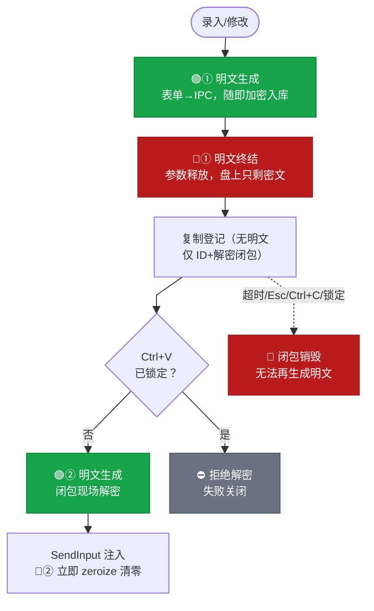

# MoyuPasswd

一款安全、简洁的桌面密码管理器，基于 Tauri 2.0 + Vue 3 + Rust 构建。

---

## ✨ 功能特性

### 核心功能

- 🔐 **主密码保护** — 使用 Argon2id 哈希 + AES-256-GCM 加密存储所有密码
- ⌨️ **Ctrl+V 注入** — 复制密码后倒计时内，在目标窗口按 `Ctrl+V` 直接注入（**密码不进系统剪贴板**），`Esc`/`Ctrl+C` 可放弃
- 🔍 **快速搜索** — 全局快捷键 `Ctrl+K` 一键呼出，支持标题/用户名/URL/自定义字段模糊搜索
- 🧩 **自定义字段** — 每条密码可携带连接地址、端口、连接命令等附加字段；可标记「敏感」加密存储，快捷查询 `→`/`Tab` 展开详情按字段复制
- ⚡ **快速添加** — `Ctrl+Shift+N` 快速录入新密码
- 🎲 **密码生成器** — 可配置长度、字符类型，实时显示密码强度
- 📋 **安全复制** — 用户名/URL 等文本复制进剪贴板后按设置自动清除（10s/30s/60s 可配）
- 📂 **分类管理** — 自定义分类，支持收藏夹功能

### 🔁 密码明文生命周期

> **入库即加密，用时才解密，用完即清零，锁定全作废。**



### 安全特性

- 🛡️ **自动锁定** — 系统空闲超时自动锁定（离开电脑才锁定），清除内存中的密钥
- 🔐 **暴力破解防护** — 连续输错渐进锁定（30s→15min），失败计数持久化、重启不清零
- 🖥️ **系统认证** — 支持 Windows Hello / Touch ID 生物识别解锁，改密后密钥自动轮换
- 🔒 **剪贴板保护** — 复制后自动清除，锁定时强制清空
- 🚫 **注入黑名单** — 默认拒绝向终端注入密码（防命令行历史/回显泄露），5 秒内再按一次 `Ctrl+V` 确认放行，可在设置中永久放行；归因失败也不注入
- 🧾 **注入审计** — 每次注入记录目标进程与结果（不含明文）
- 🔄 **改密崩溃安全** — 修改主密码失败/断电自动回滚，不丢数据
- 📁 **文件权限加固** — 数据库/审计日志文件 ACL 限制访问
- 💾 **数据导入导出** — 加密格式备份恢复；导入整包事务 + 冲突策略（默认跳过已有条目）

### 便捷功能

- 🎯 **系统托盘** — 最小化到托盘，后台静默运行
- ⌨️ **全局快捷键** — 在任何应用中快速调用
- 🚀 **开机自启** — 可选开机自动启动
- 🌙 **深色模式** — 支持亮色/暗色主题切换
- ⏱️ **倒计时提示** — 复制密码后显示倒计时悬浮窗

---

## 🛠️ 技术栈

### 前端

| 技术         | 版本 | 说明                   |
|--------------|------|------------------------|
| Vue 3        | 3.5+ | 渐进式 JavaScript 框架 |
| TypeScript   | 6.0  | 类型安全               |
| Vite         | 8.1  | 构建工具               |
| Tauri        | 2.0  | 桌面端框架             |
| Shadcn Vue   | 2.8  | UI 组件库              |
| Tailwind CSS | 4.3  | 原子化 CSS             |
| Pinia        | 4.0  | 状态管理               |
| Vue Router   | 5.2  | 路由管理               |
| vite-svg-loader | 5.1 | SVG 图标转组件（图标自管于 `src/assets/svg/`，可直接预览） |

### 后端

| 技术                     | 说明                       |
|--------------------------|----------------------------|
| Rust                     | 系统级语言，高性能         |
| Tauri 2.0                | 跨平台桌面框架             |
| SQLite (rusqlite)        | 本地数据库                 |
| AES-256-GCM              | 对称加密算法               |
| Argon2id                 | 密码哈希算法（抗暴力破解） |
| Windows Hello / Touch ID | 生物识别认证               |

---

## 📦 安装与使用

### 下载

前往 [Releases](https://github.com/your-username/moyu-passwd/releases) 页面下载最新版本：

- **Windows**: `.msi` 或 `.exe` 安装包
- **macOS**: `.dmg` 安装包（待支持）
- **Linux**: `.deb` 或 `.AppImage`（待支持）

### 首次使用

1. 启动应用后，进入 **解锁页面**
2. 点击「设置主密码」创建您的主密码
3. 主密码用于加密所有存储的密码，请牢记
4. 设置完成后即可开始添加和管理密码

### 日常使用

1. **添加密码**: 点击右上角「+」按钮，或使用快捷键 `Ctrl+Shift+N`
2. **搜索密码**: 使用快捷键 `Ctrl+K` 呼出快速搜索
3. **使用密码**: 在密码列表中点击复制图标，或在快速搜索中选中后回车——随后切到目标窗口，在倒计时内按 `Ctrl+V` 注入（密码不进剪贴板）
4. **编辑密码**: 双击密码条目进行编辑
5. **分类管理**: 在左侧边栏创建和管理分类

---

## 🚀 开发指南

### 环境要求

- Node.js >= 22.18.0 或 >= 24.12.0
- pnpm >= 8.0
- Rust >= 1.70
- Visual Studio Build Tools (Windows)

### 安装依赖

```bash
# 克隆项目
git clone https://github.com/your-username/moyu-passwd.git
cd moyu-passwd

# 安装前端依赖
pnpm install

# 安装 Rust 依赖（自动）
cd src-tauri
cargo build
```

### 开发命令

```bash
# 启动开发模式（前端 + Rust 热重载）
pnpm tauri dev

# 仅启动前端开发服务器
pnpm dev

# 类型检查
pnpm type-check

# 构建生产版本
pnpm build

# 运行单元测试
pnpm test:unit

# 打包桌面应用
pnpm release
```

### 项目结构

```
moyu-passwd/
├── src/                              # 前端源码
│   ├── assets/                       # 静态资源、样式
│   │   └── svg/                      # SVG 图标文件（可直接预览，经 vite-svg-loader 转组件）
│   ├── components/                   # Vue 组件
│   │   ├── ui/                       # Shadcn Vue 基础组件
│   │   ├── icons/                    # 图标统一导入入口（index.ts，复用 @/assets/svg）
│   │   ├── CustomFieldsEditor.vue    # 自定义字段编辑器
│   │   ├── PasswordFormDialog.vue    # 密码表单弹窗
│   │   ├── PasswordGenerator.vue     # 密码生成器
│   │   ├── PasswordStrength.vue      # 密码强度指示器
│   │   ├── QuickSearch.vue           # 快速搜索组件
│   │   ├── QuickAdd.vue              # 快速添加组件
│   │   ├── ScreenCountdown.vue       # 屏幕倒计时悬浮窗
│   │   ├── CaretCountdown.vue        # 光标跟随倒计时
│   │   └── Toast.vue                 # Toast 提示
│   ├── composables/                  # 组合式函数
│   │   ├── useTheme.ts               # 主题管理
│   │   └── useAutoLock.ts            # 用户活动上报（锁定由后端负责）
│   ├── lib/                          # 通用工具
│   │   ├── utils.ts                  # 通用工具函数
│   │   └── windowSetup.ts            # 窗口通用环境设置（禁用右键菜单等）
│   ├── stores/                       # Pinia 状态管理
│   │   ├── password.ts               # 密码数据状态
│   │   └── shortcuts.ts              # 快捷键配置状态
│   ├── views/                        # 页面视图
│   │   ├── UnlockView.vue            # 解锁页面
│   │   ├── HomeView.vue              # 密码列表主页
│   │   ├── SettingsView.vue          # 设置页面
│   │   └── CategoryView.vue          # 分类管理页面
│   └── windows/                      # 独立窗口
│       ├── QuickSearchWindow.vue     # 快速搜索窗口
│       └── CountdownWindow.vue       # 倒计时窗口
├── src-tauri/                        # Tauri 后端源码
│   ├── src/
│   │   ├── main.rs                   # 应用入口
│   │   ├── lib.rs                    # 模块注册、应用初始化
│   │   ├── db/                       # 数据库模块
│   │   │   └── mod.rs                # SQLite(SQLCipher) 初始化、迁移
│   │   ├── crypto/                   # 加密模块
│   │   │   └── mod.rs                # Argon2id、AES-256-GCM
│   │   ├── db_meta.rs                # 凭证元数据（Credential Manager / 文件）
│   │   ├── state/                    # 状态管理
│   │   │   └── mod.rs                # 密钥、解锁状态、爆破锁定计数
│   │   ├── pending.rs                # 待粘贴密码槽（延迟解密、审计）
│   │   ├── hotkey.rs                 # Ctrl+V 键盘钩子（一次性）
│   │   ├── inject.rs                 # 进程归因 + SendInput 密码注入
│   │   ├── audit.rs                  # 注入审计日志
│   │   ├── clipboard/                # 剪贴板模块（防历史/云端同步 + 定时清除）
│   │   ├── acl/                      # 文件权限加固
│   │   ├── idle/                     # 空闲检测（系统空闲为准）
│   │   ├── system_auth/              # 系统认证（Windows Hello）
│   │   └── commands/                 # Tauri 命令
│   │       ├── auth.rs               # 认证命令（含统一锁定入口 lockdown）
│   │       ├── password.rs           # 密码 CRUD
│   │       ├── category.rs           # 分类管理
│   │       ├── settings.rs           # 设置管理
│   │       ├── data.rs               # 数据导入导出
│   │       ├── shortcuts.rs          # 快捷键管理
│   │       └── countdown.rs          # 倒计时窗口管理
│   ├── tauri.conf.json               # Tauri 配置
│   ├── Cargo.toml                    # Rust 依赖配置
│   └── icons/                        # 应用图标
├── docs/                             # 文档
│   └── errors/                       # 常见问题文档
├── package.json                      # 前端依赖配置
└── README.md                         # 项目说明
```

### 图标规范

- 界面图标统一使用 `src/assets/svg/` 下的 **SVG 文件**（24×24 描边风格，IDE 可直接预览），由 vite-svg-loader 在构建时转为 Vue 组件
- 一律从 `@/components/icons` 导入复用，**不要在组件里内联 SVG，不要用 emoji 当图标**：

  ```ts
  import { IconSearch, IconLock } from '@/components/icons'
  ```

  ```vue
  <IconSearch class="h-4 w-4" />
  ```

- 新增图标：svg 文件放入 `src/assets/svg/`，在 `src/components/icons/index.ts` 追加一行导出即可

---

## ⌨️ 快捷键

### 全局快捷键（任何应用中可用）

| 功能       | 默认快捷键     | 说明                 |
|------------|----------------|----------------------|
| 快速搜索   | `Ctrl+K`       | 弹出独立搜索窗口     |
| 快速添加   | `Ctrl+Shift+N` | 弹出快速添加密码窗口 |
| 密码生成器 | `Ctrl+Shift+G` | 打开密码生成器       |

> 快捷键可在「设置 → 快捷键」页面自定义修改。

### 应用内快捷键

| 功能     | 快捷键  | 说明                  |
|----------|---------|-----------------------|
| 关闭弹窗 | `Esc`   | 关闭当前弹窗/搜索窗口 |
| 确认操作 | `Enter` | 确认当前操作          |
| 展开详情 | `→`/`Tab` | 快捷查询中展开字段详情（`←` 收起） |

---

## 🔒 安全设计

### 加密方案

```
主密码 → Argon2id 哈希 → 验证存储
                ↓
         派生 AES-256 密钥 → 加密所有密码数据
                ↓
         存储在内存中（锁定时清除）
```

### 数据存储

- **数据库文件**: `moyu_passwd.db`（SQLCipher 全库加密；密码/备注条目再以 AES-256-GCM 加密）
- **凭证元数据**: 主密码哈希与派生盐——Windows 存于 **Credential Manager**（系统加密存储），其他平台为 `.moyu_passwd_meta` 文件（ACL 加固）
- **辅助文件**: `lockout.json`（爆破锁定计数）、`audit.log`（注入审计）、`backup/`（修改主密码前的自动备份）
- **存储位置**: `%APPDATA%/com.moyu.passwd/`

### 安全措施

1. **密钥派生**: 使用 Argon2id（抗 GPU/ASIC 暴力破解），AES 密钥与数据库密钥独立派生
2. **数据加密**: SQLCipher 全库加密 + AES-256-GCM 条目加密（认证加密，防篡改）
3. **内存保护**: 锁定时清除内存中的密钥；解密闭包不持有密钥副本
4. **剪贴板保护**: 密码不进剪贴板（注入式粘贴）；文本复制后自动清除，锁定时强制清空
5. **文件权限**: 数据库/审计日志文件 ACL 限制访问
6. **空闲检测**: 系统空闲超时自动锁定
7. **爆破防护**: 连续失败渐进锁定（30s→15min），失败计数持久化
8. **注入防护**: 目标进程归因 + 终端黑名单（命中需二次确认放行，可设置永久放行），归因失败拒绝注入
9. **崩溃安全**: 修改主密码失败/断电自动回滚，不产生半新半旧的数据

---

## ⚙️ 配置说明

### 设置项

| 设置           | 说明                    | 默认值   |
|----------------|-------------------------|----------|
| 主题           | 亮色/暗色/跟随系统      | 跟随系统 |
| 开机自启       | 开机自动启动应用        | 关闭     |
| 最小化到托盘   | 关闭窗口时最小化到托盘  | 开启     |
| 显示启动时窗口 | 启动时显示主窗口        | 开启     |
| 自动锁定时间   | 空闲超时锁定（分钟）    | 5 分钟   |
| 剪贴板清除时间 | 复制后自动清除（秒）    | 30 秒    |
| 系统认证       | 使用 Windows Hello 解锁 | 关闭     |
| 允许向终端注入 | 跳过终端注入二次确认    | 关闭     |

---

## 📝 常见问题

详见 `docs/errors/` 目录：

| 文件                                             | 说明                                   |
|--------------------------------------------------|----------------------------------------|
| [rust-tauri.md](./docs/errors/rust-tauri.md)     | Rust、Tauri、Cargo 相关问题            |
| [vue-frontend.md](./docs/errors/vue-frontend.md) | Vue、Tailwind CSS、Shadcn Vue 相关问题 |

---

## 🤝 贡献

欢迎提交 Issue 和 Pull Request！

### 开发规范

详见 [.cursorrules](./.cursorrules)，包含：

- 注释要求
- 代码风格
- 提交规范

---

## 📄 许可证

[MIT License](./LICENSE)

---

## 🙏 致谢

- [Tauri](https://tauri.app/) — 跨平台桌面应用框架
- [Vue.js](https://vuejs.org/) — 渐进式 JavaScript 框架
- [Shadcn Vue](https://www.shadcn-vue.com/) — UI 组件库
- [Rust](https://www.rust-lang.org/) — 系统编程语言
